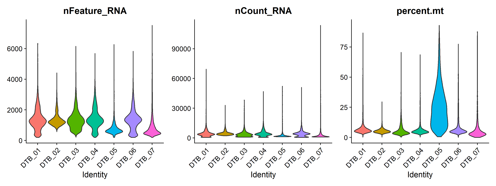
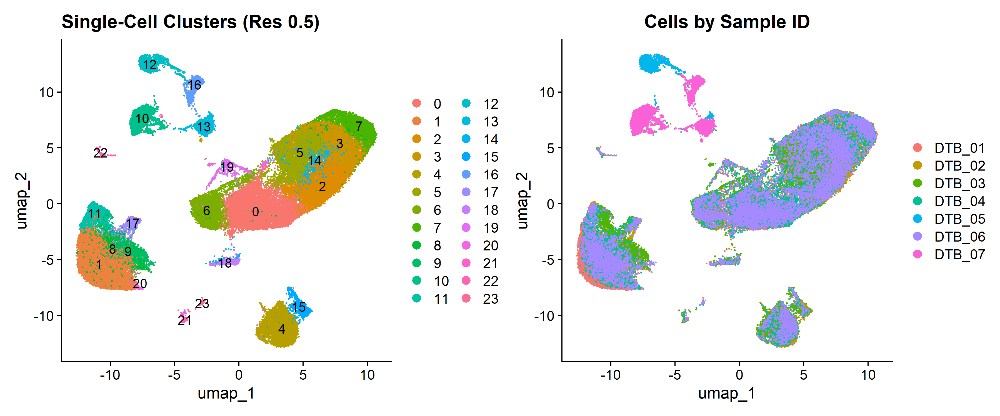
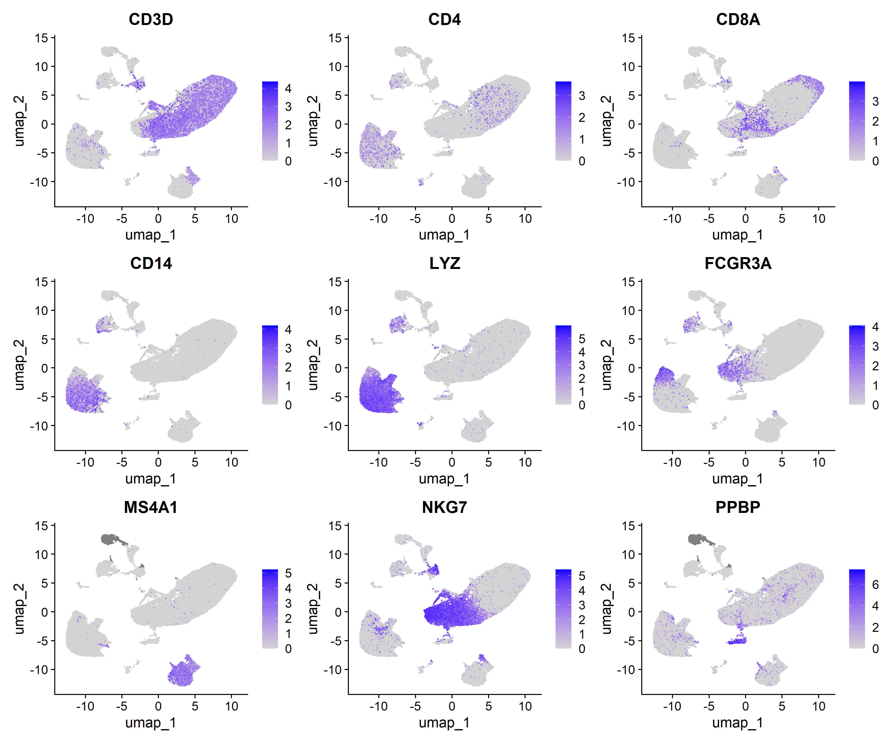
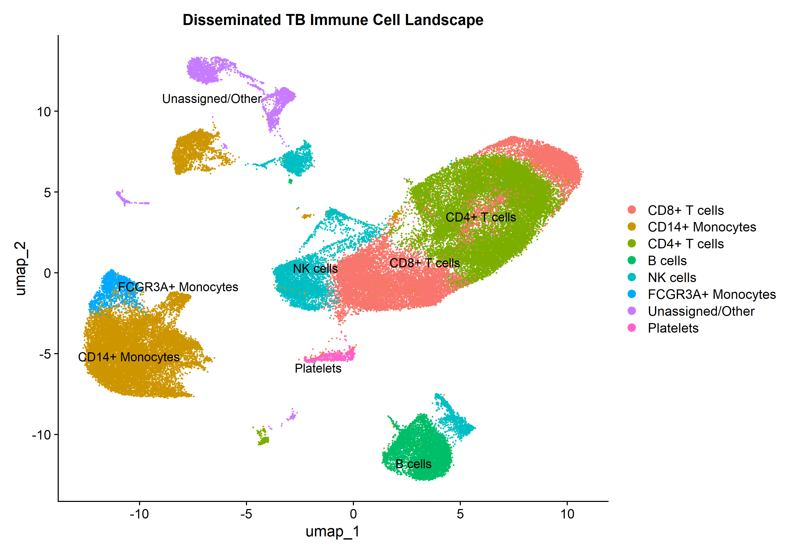

# Single-Cell RNA-Seq Analysis: Disseminated Tuberculosis

## About This Project
The goal was to re-analyze blood single-cell data from 7 Disseminated Tuberculosis (DTB) patients (GEO: **GSE287288**, 10X Genomics platform) to practice standard single-cell workflows—from raw quality control filtering to clustering, cell-type annotation, and differential expression analysis.

---

## What I Did

### 1. Quality Control & Filtering

I checked total gene counts (`nFeature_RNA`) and mitochondrial gene percentages (`percent.mt`) for all 81,852 raw cells across the 7 samples (`DTB_01` to `DTB_07`).

* **Filtering thresholds:** Kept cells with gene counts between 200 and 6,000, and mitochondrial content below 15%.
* **Result:** Filtered out ~9,576 low-quality or dying cells, retaining **72,276 clean cells**.
* **Sample observation:** Sample `DTB_05` had elevated mitochondrial counts (~25% mean MT%), likely reflecting pre-analytical sample stress or handling delay during collection.

---

### 2. Normalization, PCA & UMAP Clustering
* Normalized cell expression values using log-normalization (`scale.factor = 10000`).
* Selected the top 2,000 Highly Variable Genes (HVGs) driving cell-to-cell heterogeneity.
* Scaled the data and ran Principal Component Analysis (PCA) across 30 PCs.
* Built a 20D K-Nearest Neighbor (KNN) graph and ran Louvain clustering (`resolution = 0.5`), identifying 24 distinct cell clusters.
* Generated UMAP projections to check sample mixing. Patient samples `DTB_01`–`DTB_04` and `DTB_06` mixed smoothly across immune populations, confirming no severe technical batch artifacts.

---

### 3. Cell Type Annotation
I visualized canonical lineage markers using `FeaturePlot` and `DotPlot` then assign the cell types to the clusters based on known information from https://satijalab.org/seurat/articles/pbmc3k_tutorial.html:

#### Feature Expression Heatmaps

#### Final Annotated Immune Landscape

---

### 4. Differential Expression (Monocytes vs. T Cells)
I ran an exploratory Wilcoxon rank-sum test between **CD14+ Monocytes** and **CD4+ T cells** (`min.pct = 0.25`, `logfc.threshold = 0.25`).

Top upregulated myeloid markers in monocytes included:
* **FCN1** (+7.79 log2FC)
* **SERPINA1** (+7.74 log2FC)
* **LYZ** (+7.59 log2FC)
* **TYROBP** (+6.55 log2FC)
* **HLA-DRA** (+5.02 log2FC)

---

## Key References
* **Luecken & Theis (2019)** *Current best practices in single-cell RNA-seq analysis: a tutorial.* **Mol Syst Biol**, 15:e8746.
* *https://satijalab.org/seurat/articles/pbmc3k_tutorial.html*
